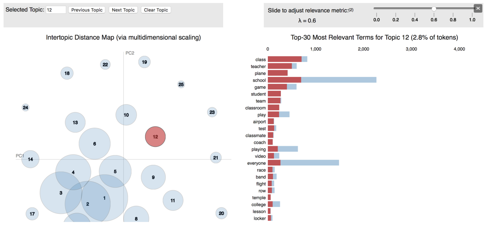

Hi! My name Sunny Hong and I will be graduating on September 2020 with a degree in Statistics and Data Science at the University of California, Santa Barbara. Yes, I am the class of 2020. This year has been a concentrated time of relearning, reeducating, and sacrificing in the light of coronavirus, heighten racial profiling, and Black Lives Matter movements. 

As a first-generation college student, women in data science, and a part of the 4.3% of DACA students in higher education, I am looking for opportunities to be part of a movement that is in the center of cultivating positive cultures for the community. I am passionate about making more meaning out of numbers and data. I enjoy building machines, executing predictive analysis, and statistical analysis to breakthrough problems. I am excited to work with products that enables EVERYONE to find a better solution in their daily lives. Through leadership opportunities with Epic (CRU) and Data Science UCSB club, I realized my strengths in working with different minds and being a self-starter. Leading these teams and events taught me how to be an initiative and confident leader as well. 

I have worked at **YMCA Channel Islands Office** and at the **Geography Department UCSB.** 

I have interned as a **Data Scientist** the past year with **YMCA Channel Islands** with **Jill Muchow Rode**, my supervisor as well as the Chief Development Officer of the Y. I got to start on my very own project with the data provided. I was able to build a map that showed the impact of donors on the work of the Y. I researched on the words used through NLP using great impactful nonprofit organization websites. I've also worked on topic modeling to build impactful stories for my impact map. Through Power BI, a business analytics service, I was able to build an interactive map to target both older and newer generations audiences.

Due to security I've attached a example of what a topic model would look like. (pretty cool!)

I am currently continuing my **research assistant** position with **Professor Elizabeth Ackert** at the Geography Department of UCSB. As a research assistant for the **"Latinx Destinations and Health Project"** I assist the team with my data manipulation and data analysis skills. One of our aims is to compare health care supply across Latino/a destination. As the research assistant, I use R and RSQL to manipulate multiple data sets to prepare for multivariate analysis. 

##### My Resume (Updated on: September 14, 2020 )

-  attach is a [pdf version of myresume](https://github.com/sunny7x7/Resume)

