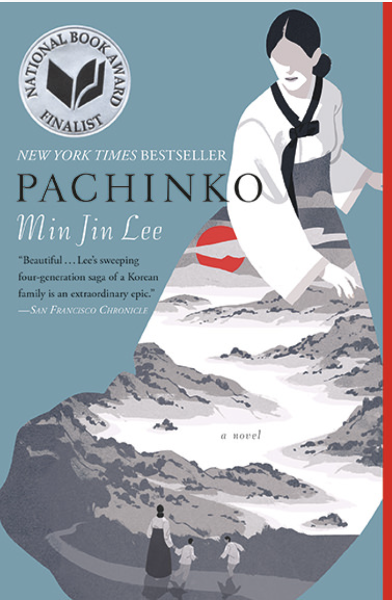
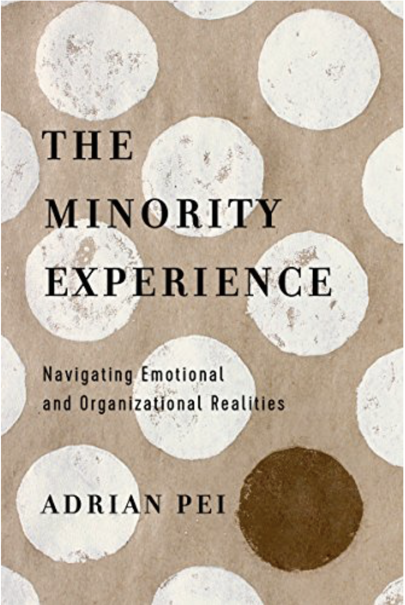
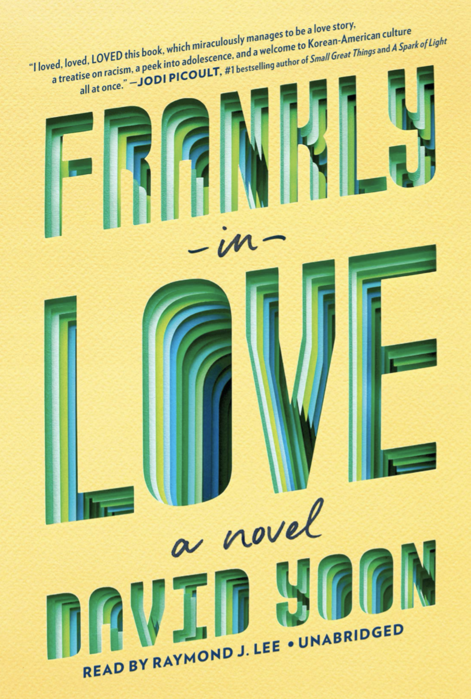
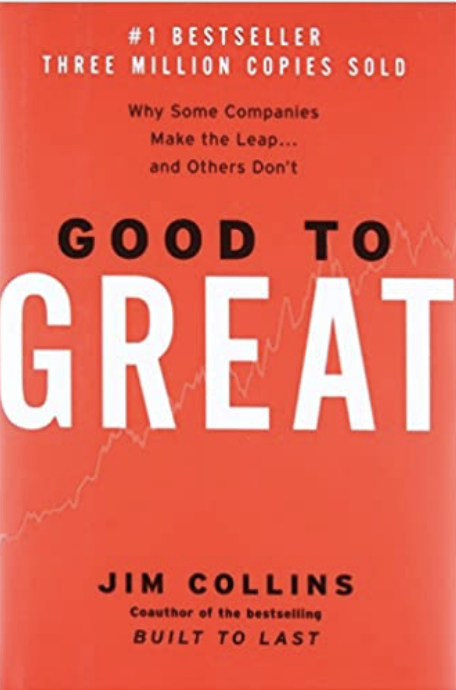
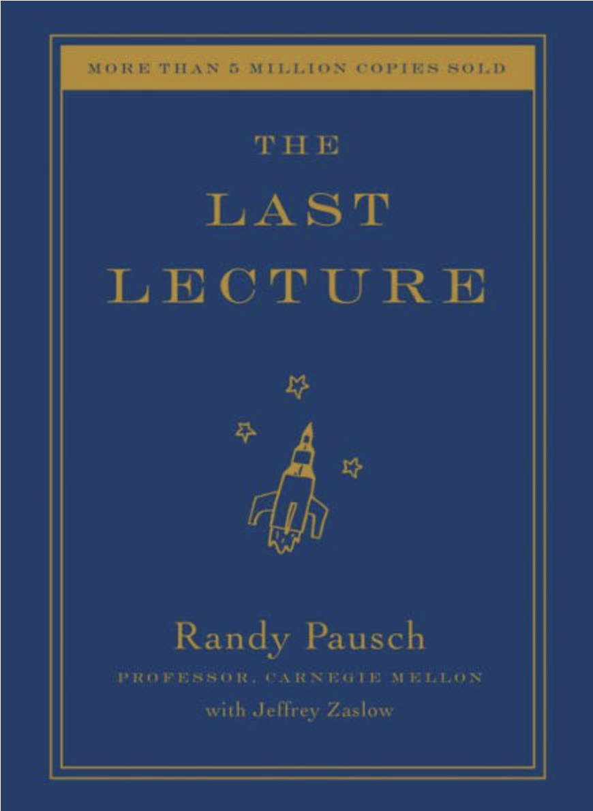

# Culture 

#### If you are looking for something centered on family and power of mother...and lots of tears
### [Pachinko by Min Jin Lee](https://www.minjinlee.com/book/pachinko/)
_New York Times Bestseller_

#### If you are looking for a deep connection and understanding of the experience as an minority leader...
### [The Minority Experience- Navigating Emotional Organizational Realities by Andrian Pei](https://www.amazon.com/Minority-Experience-Navigating-Emotional-Organizational/dp/0830845488)

 
 
 
#### If you wish you had a Korean-American romance book growing up but never had so reading it in the 2020...
### [Frankly in Love by David Yoon](https://www.penguinrandomhouse.com/books/598579/frankly-in-love-by-david-yoon/)

 
 
 
 
 
# Education 
 

#### If you are looking to learn and see what makes a good leader and how you can be a perfect follower...
### [GOOD TO GREAT by Jim Collins](https://www.amazon.com/Good-Great-Some-Companies-Others/dp/0066620996)

 
 
 
#### If you are looking to something passionate, everlasting, and tearful...
### [Last Lecture by Randy Pausch](https://www.amazon.com/Last-Lecture-Randy-Pausch/dp/1401323251)

 
 

